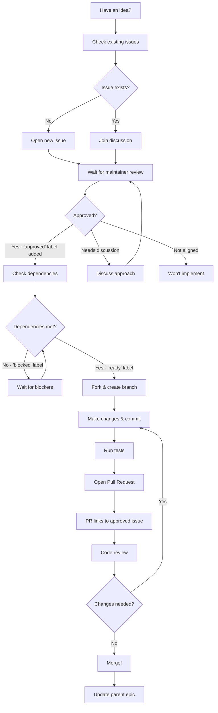

# Contributing to DiracX

## Contribution Workflow

All contributions to DiracX must follow this workflow to ensure alignment with project goals and maintain code quality:

### How Work Is Organized

We use **epics** and **tasks** with explicit dependencies to organize work. This helps you understand what needs to happen before you can work on something, and shows you what's ready to work on right now.

#### Epics (Parent Issues)

Large features broken into smaller, manageable tasks. Look for the `type: epic` label.

**Example:** An epic titled "Implement New Authentication System" might include:

- Design authentication architecture
- Set up OAuth2 dependencies
- Create database migrations
- Implement login endpoints
- Update frontend components

Each epic shows:

- **Overall goal** and context
- **Task list** with checkboxes linking to child issues
- **Prerequisites** (must complete first)
- **Core work** (can be done in parallel)
- **Follow-up work** (done after core features)

#### Tasks (Child Issues)

Individual pieces of work that contribute to an epic. Look for the `type: task` label.

Each task clearly shows:

- **Parent epic** it belongs to
- **Dependencies** (which issues must be completed first)
- **What it blocks** (which issues depend on this one)
- **Acceptance criteria** (what "done" looks like)

### 1. Open an Issue

**⚠️ Important: All contributions must start with an approved issue.**

- **Before Writing Code:** Open an issue describing your proposed change, whether it's a bug fix, feature, or improvement.
- **Wait for Approval:** A maintainer will review your issue and add the `approved` label if it aligns with DiracX project goals and architecture. **Do not start development until your issue is approved.**
- **Discussion:** Maintainers may add the `needs-discussion` label if the approach needs further design work. Participate in the discussion to refine the proposal.
- **Check for Existing Issues:** Before opening a new issue, search for similar issues to avoid duplicates.

**Exception:** For trivial bug fixes (e.g., fixing a clear typo in code, correcting an obvious logic error, or fixing a broken link), you may open a PR directly without prior issue approval. Please clearly describe the bug and the fix in your PR description.

**Why this process?** This workflow helps ensure that:

- Contributions align with the project's technical direction and goals
- Contributors receive early feedback on their approach, making the development process smoother
- Everyone's time is used effectively, including yours
- The codebase maintains consistency and quality

**Good to know:** If you want to start contributing right away, check out the issues labeled with ["approved"](https://github.com/DIRACGrid/diracx/labels/approved) and ["good first issue"](https://github.com/DIRACGrid/diracx/labels/good%20first%20issue). These are issues that have already been vetted and are well-suited for newcomers. Similar issues exist for [diracx-web](https://github.com/DIRACGrid/diracx-web/labels/good%20first%20issue) and [diracx-charts](https://github.com/DIRACGrid/diracx-charts/labels/good%20first%20issue).

### 2. Make Changes

Once your issue has been approved:

- **Fork the Repository:** Fork the repository and create a new branch for your work. Use a descriptive name for your branch that reflects the work you are doing.
- **Requirements:** [Getting Started](../tutorials/getting-started.md)

### 3. Commit

- **Conventional Commits:** All commits must follow the [Conventional Commits](https://www.conventionalcommits.org/) specification. This ensures that commit messages are structured and consistent, which is important for automation and versioning.

    - **Examples:**
        - `feat(cli): add transformation debug command`
        - `fix(api): handle null values in response`
        - `chore(readme): update contributing guidelines`
    - **Why?** If your commit messages do not follow this convention, the Continuous Integration (CI) process will fail, and your PR will not be merged. Please ensure your commit messages are properly formatted before pushing.

### 4. Make a Pull Request (PR)

- **Link to Approved Issue:** Your PR **must** link to an approved issue. Include `Fixes #123` (replace 123 with your issue number) in the PR description.
- **Automated Checks:** GitHub Actions will automatically verify that your PR links to an issue with the `approved` label. PRs without approved issues cannot be merged.
- **Clear Description:** Include a clear description of what your PR does and how it addresses the linked issue.
- **Review Process:** Your PR will be reviewed by project maintainers. Please be patient and responsive to any feedback you receive.

### 5 Additional Notes

- **Trivial Changes:** For very minor changes like fixing typos in documentation, you may skip the issue approval step, but we still encourage opening an issue for tracking purposes.
- **Stay Up-to-Date:** Make sure your branch is up-to-date with the latest changes in the main branch before submitting your PR. Use `git rebase` if necessary.
- **Questions?** If you're unsure about anything in this process, feel free to ask in the issue discussion or reach out to maintainers.

## Labels Used in This Workflow

- `awaiting-triage` - Issue has been opened and is waiting for maintainer review
- `approved` - Issue has been approved and is ready for development
- `needs-discussion` - Issue needs further discussion before approval
- `needs-approved-issue` - PR is missing a link to an approved issue
- `good first issue` - Good for newcomers (these are already approved)
